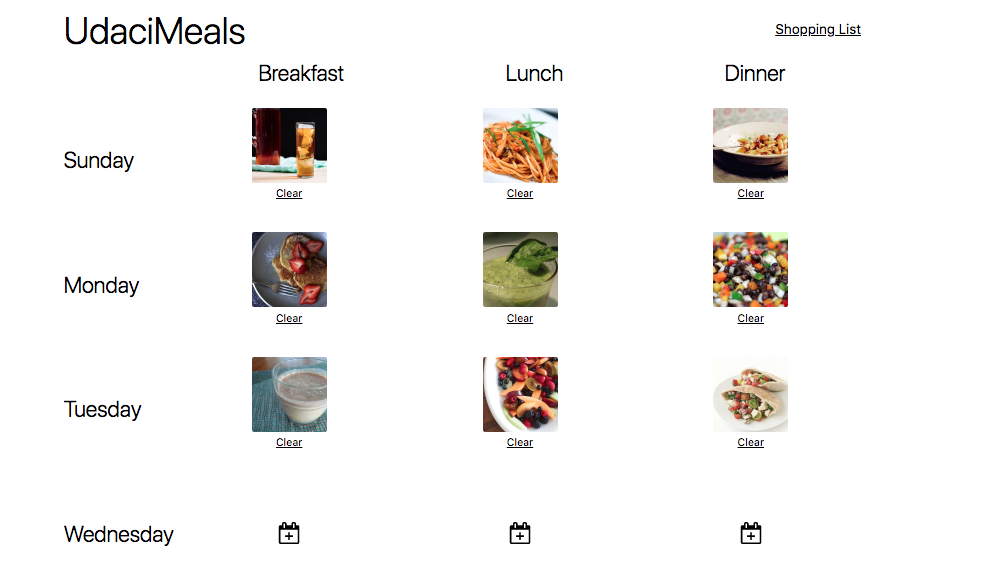
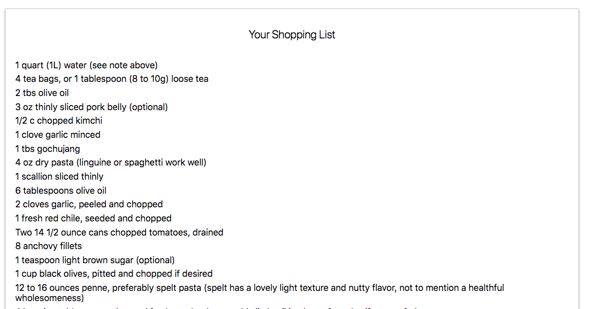

##UdaciMeals - a food calendar application

## Project Setup

The REACT application was created with create-react-app and requires only npm install and npm start to get it installed and launched.

## Installation and Launching
clone the Project - git clone https://github.com/sonalikatara/udacimeal

This application uses API's from [Edamam developer site](https://developer.edamam.com/edamam-recipe-api). You will have to register and  place your unique ID and API key in the .env file

install the dependencies - npm install

start the project with npm - npm start serve

listen the server on http://localhost:3000

## Features

** Calendar **

This application has a Calendar that shows 3 differents meals for a day.

You can click on the calendar icon for a meal and search it for pictures and ingredients.

** Shopping List **

The application creates a shopping list of all the ingredients for the recipies on the calendar.

## Motivation

This project is made learning how to build React-Redux applications
